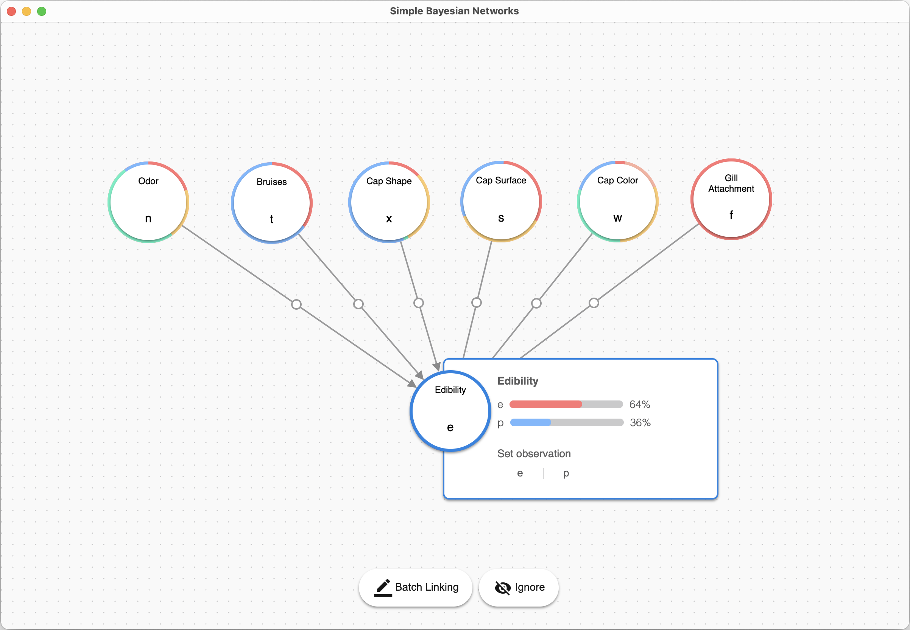

# SimpleBN
A simple visual tool to build and run inference on your own Bayesian Network.



## Features
* Load your own data in CSV/Excel format.
* Define custom network structures.
* Condition on observations to see real-time inference result on other variables.
* Save & load your model.
* Overall a nice interface and smooth interactions.

## How to use

### Installation
You need to have [Python 3](https://www.python.org/downloads/) installed.

Open up your favorite terminal, and run the following command to install the required libraries:
```
pip install eel pandas openpyxl pgmpy python-datauri
```

Finally, clone this repo. In the base directory of this repo, start `app.py` to see the GUI:
```
python app.py
```

### Loading data / model
Your dataset should be a CSV/Excel file. Each column is a variable, and the first row contains the variable names, like so:

| Var 1  | Var 2  | ... | Var N  |
| ------ | ------ | --- | ------ |
| Value  | Value  | ... | Value  |
| Value  | Value  | ... | Value  |
| Value  | Value  | ... | Value  |
| ...    | ...    | ... | ...    |

A sample excerpt of the mushroom dataset is included for your reference in the `sample` folder.

Alternatively, you can also load a model you have saved.

### Defining network structure
Click on any node to see the detailed distribution of this variable. When a variable is selected, you can drag from it onto another variable to create a link. Alternatively, you can select a variable and click "Batch Linking," this way you can simply click on other variables to create links.

To remove a link, click on the circle handle of that link and click the "Delete Link" button.

### Running inference
Click "Start Inference" to start running inference. Depending on your model complexity and dataset size, it may take some time to finish.

### Saving models
The models are saved as a json file. You can click the "Load Dataset/Model" button to load it again.
